# Entity Relationship Map

This document provides the complete entity relationship map for the Ahram Distribution database. The schema spans 65+ tables across identity, access control, customer, product, order, collection, return, visit, auction, deal, credit, tier, and target domains. The Mermaid ER diagram below captures all tables and their foreign-key relationships.

---

## Mermaid ER Diagram

```mermaid
erDiagram
    %% ========================================================================
    %% CORE: Identity & Employee
    %% ========================================================================
    IDENTITIES ||--o| EMPLOYEES : "is one"
    IDENTITIES ||--o| CUSTOMERS : "is one"
    EMPLOYEES ||--o{ EMPLOYEES : "manages"
    EMPLOYEES ||--o{ CUSTOMERS : "owns"
    IDENTITIES ||--o{ APP_SESSIONS : "authenticates"

    %% ========================================================================
    %% ACCESS CONTROL
    %% ========================================================================
    ROLES ||--o{ EMPLOYEE_ROLES : "assigned to"
    EMPLOYEES ||--o{ EMPLOYEE_ROLES : "has"
    ROLES ||--o{ ROLE_CAPABILITIES : "grants"
    CAPABILITIES ||--o{ ROLE_CAPABILITIES : "assigned to"
    EMPLOYEES ||--o{ EMPLOYEE_CAPABILITIES : "directly granted"
    CAPABILITIES ||--o{ EMPLOYEE_CAPABILITIES : "assigned to"

    %% ========================================================================
    %% CUSTOMER PROFILE
    %% ========================================================================
    CUSTOMERS ||--o{ CUSTOMER_ADDRESSES : "has"
    CUSTOMERS ||--o{ CUSTOMER_CONTACTS : "has"
    CUSTOMERS ||--o{ CUSTOMER_OWNERSHIP_HISTORY : "tracks"
    EMPLOYEES ||--o{ CUSTOMER_OWNERSHIP_HISTORY : "records change"

    %% ========================================================================
    %% UNIFIED LOCATIONS
    %% ========================================================================
    UNIFIED_LOCATIONS ||--o| CUSTOMERS : "located at"
    UNIFIED_LOCATIONS ||--o{ VISITS : "start location"
    UNIFIED_LOCATIONS ||--o{ VISITS : "end location"
    UNIFIED_LOCATIONS ||--o{ ORDERS : "execution location"

    %% ========================================================================
    %% PRODUCTS & CATALOG
    %% ========================================================================
    COMPANIES ||--o{ PRODUCTS : "manufactures"
    PRODUCTS ||--o{ PRODUCT_UNITS : "sold as"
    PRODUCTS ||--o| INVENTORY : "stocked as"

    %% ========================================================================
    %% ORDERS
    %% ========================================================================
    TIERS ||--o{ ORDERS : "priced under"
    CUSTOMERS ||--o{ ORDERS : "places"
    EMPLOYEES ||--o{ ORDERS : "created by"
    ORDERS ||--o{ ORDER_ITEMS : "contains"
    ORDERS ||--o{ ORDER_STATUS_HISTORY : "tracks"
    ORDERS ||--o{ ORDER_MODIFICATION_HISTORY : "audits"
    ORDERS ||--o{ DELIVERY_TRACKING : "delivers"
    ORDERS ||--o{ PREPARATION_RECORDS : "prepares"
    PREPARATION_RECORDS ||--o{ PREPARATION_EXCEPTIONS : "may have"
    ORDERS ||--o{ RETURNS : "returned via"
    ORDERS ||--o{ CREDIT_INVOICES : "invoiced as"

    %% ========================================================================
    %% DAILY DEALS
    %% ========================================================================
    EMPLOYEES ||--o{ DAILY_DEALS : "creates"
    DAILY_DEALS ||--o{ DAILY_DEAL_ITEMS : "bundles"
    PRODUCTS ||--o{ DAILY_DEAL_ITEMS : "included in"
    ORDERS ||--o{ ORDER_DAILY_DEALS : "includes"
    DAILY_DEALS ||--o{ ORDER_DAILY_DEALS : "purchased via"

    %% ========================================================================
    %% FLASH OFFERS
    %% ========================================================================
    EMPLOYEES ||--o{ FLASH_OFFERS : "creates"
    FLASH_OFFERS ||--o{ FLASH_OFFER_ITEMS : "bundles"
    PRODUCTS ||--o{ FLASH_OFFER_ITEMS : "included in"
    ORDERS ||--o{ ORDER_FLASH_OFFERS : "includes"
    FLASH_OFFERS ||--o{ ORDER_FLASH_OFFERS : "purchased via"

    %% ========================================================================
    %% PACKAGES (Legacy)
    %% ========================================================================
    EMPLOYEES ||--o{ PACKAGES : "creates"
    PACKAGES ||--o{ PACKAGE_ITEMS : "bundles"
    PRODUCTS ||--o{ PACKAGE_ITEMS : "included in"
    PACKAGES ||--o{ PACKAGE_ORDERS : "linked to"
    ORDERS ||--o{ PACKAGE_ORDERS : "contains"

    %% ========================================================================
    %% COLLECTIONS & TREASURY
    %% ========================================================================
    CUSTOMERS ||--o{ COLLECTIONS : "pays"
    EMPLOYEES ||--o{ COLLECTIONS : "collected by"
    EMPLOYEES ||--o{ TREASURY_TRANSACTIONS : "records"
    EMPLOYEES ||--o{ EXPENSES : "incurs"
    EMPLOYEES ||--o{ EMPLOYEE_ADVANCES : "receives"

    %% ========================================================================
    %% RETURNS
    %% ========================================================================
    CUSTOMERS ||--o{ RETURNS : "returns goods"
    RETURNS ||--o{ RETURN_ITEMS : "contains"
    PRODUCTS ||--o{ RETURN_ITEMS : "returned"
    RETURN_ITEMS ||--o| RETURN_INSPECTION : "inspected as"
    EMPLOYEES ||--o{ RETURN_INSPECTION : "inspected by"

    %% ========================================================================
    %% VISITS
    %% ========================================================================
    EMPLOYEES ||--o{ VISITS : "performs"
    CUSTOMERS ||--o{ VISITS : "visited"

    %% ========================================================================
    %% AUCTIONS
    %% ========================================================================
    EMPLOYEES ||--o{ AUCTIONS : "creates"
    AUCTIONS ||--o{ AUCTION_ITEMS : "offers"
    PRODUCTS ||--o{ AUCTION_ITEMS : "included in"
    AUCTIONS ||--o{ AUCTION_PARTICIPANTS : "has"
    AUCTIONS ||--o{ AUCTION_BIDS : "receives"
    AUCTION_PARTICIPANTS ||--o{ AUCTION_BIDS : "places"
    AUCTIONS ||--o{ AUCTION_AWARDS : "generates"
    AUCTION_PARTICIPANTS ||--o{ AUCTION_AWARDS : "receives"
    AUCTIONS ||--o{ AUCTION_ACTIVITY : "logs"
    ORDERS ||--o{ AUCTION_AWARDS : "fulfills"

    %% ========================================================================
    %% CREDIT SYSTEM
    %% ========================================================================
    CREDIT_PROGRAMS ||--o{ CUSTOMER_CREDIT_ACCOUNTS : "defines"
    CUSTOMERS ||--o| CUSTOMER_CREDIT_ACCOUNTS : "has"
    CUSTOMERS ||--o{ CREDIT_APPLICATIONS : "submits"
    CREDIT_PROGRAMS ||--o{ CREDIT_APPLICATIONS : "applies for"
    EMPLOYEES ||--o{ CREDIT_APPLICATIONS : "reviews"
    CUSTOMERS ||--o{ CREDIT_LEDGER : "tracks"
    EMPLOYEES ||--o{ CREDIT_LEDGER : "records"
    CUSTOMERS ||--o{ CREDIT_INVOICES : "owes"
    CREDIT_INVOICES ||--o| CREDIT_INVOICE_CHEQUES : "secured by"
    CREDIT_APPLICATIONS ||--o{ CREDIT_CONTRACTS : "generates"
    CUSTOMERS ||--o{ CREDIT_CONTRACTS : "signs"
    CREDIT_CONTRACT_TEMPLATES ||--o{ CREDIT_CONTRACTS : "based on"

    %% ========================================================================
    %% TIERS
    %% ========================================================================
    TIERS ||--o{ TIER_EXCEPTIONS : "overridden for"
    CUSTOMERS ||--o{ TIER_EXCEPTIONS : "receives override"
    TIERS ||--o{ TIER_COMPANY_EXCEPTIONS : "overridden for company"
    COMPANIES ||--o{ TIER_COMPANY_EXCEPTIONS : "has exception"
    TIERS ||--o{ TIER_PRODUCT_EXCEPTIONS : "overridden for product"
    PRODUCTS ||--o{ TIER_PRODUCT_EXCEPTIONS : "has exception"

    %% ========================================================================
    %% TARGETS
    %% ========================================================================
    EMPLOYEES ||--o{ EMPLOYEE_MONTHLY_TARGETS : "assigned"
```

---

## Entity Clusters

### 1. Core Identity & Employee

| Table | Description | Key Relationships |
|---|---|---|
| `identities` | Single source of truth for authentication. Globally unique phone across all user types. | Referenced 1:1 by `employees` and `customers`. |
| `employees` | Personnel records with hierarchical management chain. | Self-ref `manager_id`; 1:1 `identity_id`; 1:N to `customers` (ownership). |
| `app.sessions` | Custom auth session store. Token-based with 24h expiry. | FK to `identities`, optional FKs to `employees`/`customers`. |

### 2. Access Control

| Table | Description |
|---|---|
| `roles` | Dynamic role definitions (data-driven, not hardcoded). |
| `capabilities` | Granular permission definitions (e.g., `order.create`, `customer.view`). |
| `employee_roles` | Junction: which employee has which role. |
| `role_capabilities` | Junction: which role grants which capabilities. |
| `employee_capabilities` | Direct capability grants/denies per employee (overrides role-based). |

Capability resolution priority: direct `grant` > role-based > direct `deny`.

### 3. Customer Profile

| Table | Description |
|---|---|
| `customers` | Business entities that place orders. Owned by Sales Representatives. Includes `business_type`, `responsible_name`, and `location_id`. |
| `customer_addresses` | Multiple shipping/billing addresses per customer (CASCADE delete). |
| `customer_contacts` | Multiple contact persons per customer (CASCADE delete). |
| `customer_ownership_history` | INSERT-only audit trail of ownership changes. |
| `customer_credit_ledger` | INSERT-only running credit balance per customer. |

### 4. Unified Locations

| Table | Description |
|---|---|
| `unified_locations` | Reusable GPS/text address records. Referenced by `customers`, `visits` (start/end), and `orders` (execution). |

### 5. Products & Catalog

| Table | Description |
|---|---|
| `companies` | Product manufacturers/brands. `legacy_code` is immutable from previous system. |
| `products` | Individual products per company. Price computed from `carton_price` and `carton_quantity`. |
| `product_units` | Supported sales units: `piece`, `dozen`, `carton`. |
| `inventory` | 1:1 per product. Manual stock tracking. Deducted at order approval. |

### 6. Orders

The central business transaction. Includes snapshot columns (denormalized) for immutable point-in-time data:

| Column | Description |
|---|---|
| `snapshot_customer_name/phone/address` | Frozen customer data at order creation |
| `snapshot_owner_name/phone/address` | Frozen owner (sales rep) data |
| `snapshot_sender_name/phone/address` | Frozen sender data (creator) — deprecated in favor of sender above |

Supporting tables:
- `order_items` — Line items with prices captured at order time
- `order_status_history` — INSERT-only status audit trail
- `order_modification_history` — Audit trail of edits after submission
- `delivery_tracking` — Assignment and delivery status
- `preparation_records` — Warehouse preparation lifecycle (1:1 with order)
- `preparation_exceptions` — Exception records during preparation

### 7. Daily Deals & Flash Offers

Both follow the same pattern:
- **Deal/Offer** defines a fixed-price package with limited quantity
- **Items** link products with quantities to the deal
- **Order join tables** (`order_daily_deals`, `order_flash_offers`) snapshot price at order time and track inventory deduction

### 8. Packages (Legacy)

The original Phase 9 implementation of Daily Deals/Flash Offers. Superseded by dedicated `daily_deals` and `flash_offers` modules. `packages` table remains for backward compatibility.

### 9. Auctions

Real-time B2B auction system:
- `auctions` — Auction room with start/end time, price tracking
- `auction_items` — Products included in the auction package
- `auction_participants` — Registered participants (employee or customer)
- `auction_bids` — Bid records with real-time `is_winning` flag
- `auction_awards` — Winner awards with 1-hour confirmation window
- `auction_activity` — Realtime activity feed

### 10. Collections & Treasury

- `collections` — Payment collections from customers (cash, bank transfer, cheque, deposit)
- `treasury_transactions` — Single treasury fund movement log (inflow/outflow)
- `expenses` — Operational expenditures
- `employee_advances` — Advances paid to employees

### 11. Returns

- `returns` — Sales returns against delivered orders. Credit note generated on approval.
- `return_items` — Line items being returned
- `return_inspection` — 1:1 inspection per return item (saleable/damaged/expired/unsaleable)

### 12. Visits

Sales representative visits with GPS check-in/out, start/end location from `unified_locations`, and visit results.

### 13. Credit System

| Table | Description |
|---|---|
| `credit_programs` | Program definitions (credit limit, payment term). |
| `credit_applications` | Customer applications for credit (documents, review workflow). |
| `customer_credit_accounts` | Active credit accounts (1:1 per customer). Tracks outstanding + reserved credit. |
| `credit_invoices` | Per-order invoices generated when credit reservation converts to outstanding. |
| `credit_invoice_cheques` | 1:1 cheque per invoice. Tracks collection status. |
| `credit_contracts` | Signed contracts with program terms snapshot. |
| `credit_contract_templates` | Reusable contract text templates. |

### 14. Tiers

Pricing tiers with discount hierarchy:
1. **Tier default** — `tiers.discount_percent`
2. **Company exception** — `tier_company_exceptions.discount_percent` (override per company+tier)
3. **Product exception** — `tier_product_exceptions.discount_percent` (override per product+tier or all tiers)
4. **Customer exception** — `tier_exceptions` (override tier assignment per customer)

### 15. Targets

- `company_monthly_targets` — Company-wide monthly sales/visits/orders targets with KPI weighting
- `employee_monthly_targets` — Per-employee monthly targets

### 16. Additional Standalone Tables

- `company_profile` — Single-row (id=1) company branding and contact info
- `code_sequences` — Atomic sequence counters for generating human-readable business codes

---

## Foreign Key Reference

### CORE

| FK | Source Column | Target Table | Target Column |
|---|---|---|---|
| employees → identities | `employees.identity_id` | `identities` | `id` |
| employees → employees | `employees.manager_id` | `employees` | `id` |
| customers → identities | `customers.identity_id` | `identities` | `id` |
| customers → employees | `customers.owner_id` | `employees` | `id` |
| customers → unified_locations | `customers.location_id` | `unified_locations` | `id` |
| app.sessions → identities | `app.sessions.identity_id` | `identities` | `id` |

### ACCESS CONTROL

| FK | Source Column | Target Table | Target Column |
|---|---|---|---|
| employee_roles → employees | `employee_roles.employee_id` | `employees` | `id` |
| employee_roles → roles | `employee_roles.role_id` | `roles` | `id` |
| role_capabilities → roles | `role_capabilities.role_id` | `roles` | `id` |
| role_capabilities → capabilities | `role_capabilities.capability_id` | `capabilities` | `id` |
| employee_capabilities → employees | `employee_capabilities.employee_id` | `employees` | `id` |
| employee_capabilities → capabilities | `employee_capabilities.capability_id` | `capabilities` | `id` |

### CUSTOMER PROFILE

| FK | Source Column | Target Table | Target Column |
|---|---|---|---|
| customer_addresses → customers | `customer_addresses.customer_id` | `customers` | `id` |
| customer_contacts → customers | `customer_contacts.customer_id` | `customers` | `id` |
| customer_ownership_history → customers | `customer_ownership_history.customer_id` | `customers` | `id` |
| customer_ownership_history → employees | `customer_ownership_history.previous_owner_id` | `employees` | `id` |
| customer_ownership_history → employees | `customer_ownership_history.new_owner_id` | `employees` | `id` |
| customer_ownership_history → employees | `customer_ownership_history.changed_by` | `employees` | `id` |
| customer_credit_ledger → customers | `customer_credit_ledger.customer_id` | `customers` | `id` |
| customer_credit_ledger → employees | `customer_credit_ledger.created_by` | `employees` | `id` |

### PRODUCTS

| FK | Source Column | Target Table | Target Column |
|---|---|---|---|
| products → companies | `products.company_id` | `companies` | `id` |
| product_units → products | `product_units.product_id` | `products` | `id` |
| inventory → products | `inventory.product_id` | `products` | `id` |

### ORDERS

| FK | Source Column | Target Table | Target Column |
|---|---|---|---|
| orders → customers | `orders.customer_id` | `customers` | `id` |
| orders → tiers | `orders.tier_id` | `tiers` | `id` |
| orders → unified_locations | `orders.execution_location_id` | `unified_locations` | `id` |
| order_items → orders | `order_items.order_id` | `orders` | `id` |
| order_items → products | `order_items.product_id` | `products` | `id` |
| order_status_history → orders | `order_status_history.order_id` | `orders` | `id` |
| order_modification_history → orders | `order_modification_history.order_id` | `orders` | `id` |
| delivery_tracking → orders | `delivery_tracking.order_id` | `orders` | `id` |
| delivery_tracking → employees | `delivery_tracking.assigned_to` | `employees` | `id` |
| delivery_tracking → employees | `delivery_tracking.assigned_by` | `employees` | `id` |
| preparation_records → orders | `preparation_records.order_id` | `orders` | `id` |
| preparation_records → employees | `preparation_records.started_by` | `employees` | `id` |
| preparation_records → employees | `preparation_records.completed_by` | `employees` | `id` |
| preparation_records → employees | `preparation_records.reviewed_by` | `employees` | `id` |
| preparation_records → employees | `preparation_records.cancelled_by` | `employees` | `id` |
| preparation_exceptions → preparation_records | `preparation_exceptions.preparation_id` | `preparation_records` | `id` |

### DEALS

| FK | Source Column | Target Table | Target Column |
|---|---|---|---|
| daily_deals → employees | `daily_deals.created_by` | `employees` | `id` |
| daily_deal_items → daily_deals | `daily_deal_items.deal_id` | `daily_deals` | `id` |
| daily_deal_items → products | `daily_deal_items.product_id` | `products` | `id` |
| order_daily_deals → orders | `order_daily_deals.order_id` | `orders` | `id` |
| order_daily_deals → daily_deals | `order_daily_deals.deal_id` | `daily_deals` | `id` |
| flash_offers → employees | `flash_offers.created_by` | `employees` | `id` |
| flash_offer_items → flash_offers | `flash_offer_items.offer_id` | `flash_offers` | `id` |
| flash_offer_items → products | `flash_offer_items.product_id` | `products` | `id` |
| order_flash_offers → orders | `order_flash_offers.order_id` | `orders` | `id` |
| order_flash_offers → flash_offers | `order_flash_offers.offer_id` | `flash_offers` | `id` |

### AUCTIONS

| FK | Source Column | Target Table | Target Column |
|---|---|---|---|
| auctions → employees | `auctions.created_by` | `employees` | `id` |
| auction_items → auctions | `auction_items.auction_id` | `auctions` | `id` |
| auction_items → products | `auction_items.product_id` | `products` | `id` |
| auction_participants → auctions | `auction_participants.auction_id` | `auctions` | `id` |
| auction_bids → auctions | `auction_bids.auction_id` | `auctions` | `id` |
| auction_bids → auction_participants | `auction_bids.participant_id` | `auction_participants` | `id` |
| auction_awards → auctions | `auction_awards.auction_id` | `auctions` | `id` |
| auction_awards → auction_participants | `auction_awards.participant_id` | `auction_participants` | `id` |
| auction_awards → orders | `auction_awards.order_id` | `orders` | `id` |
| auction_awards → employees | `auction_awards.awarded_by` | `employees` | `id` |
| auction_activity → auctions | `auction_activity.auction_id` | `auctions` | `id` |

### COLLECTIONS

| FK | Source Column | Target Table | Target Column |
|---|---|---|---|
| collections → customers | `collections.customer_id` | `customers` | `id` |
| collections → employees | `collections.created_by` | `employees` | `id` |
| collections → employees | `collections.approved_by` | `employees` | `id` |
| treasury_transactions → employees | `treasury_transactions.created_by` | `employees` | `id` |
| expenses → employees | `expenses.created_by` | `employees` | `id` |
| expenses → employees | `expenses.approved_by` | `employees` | `id` |
| employee_advances → employees | `employee_advances.employee_id` | `employees` | `id` |
| employee_advances → employees | `employee_advances.approved_by` | `employees` | `id` |
| employee_advances → employees | `employee_advances.created_by` | `employees` | `id` |

### RETURNS

| FK | Source Column | Target Table | Target Column |
|---|---|---|---|
| returns → orders | `returns.order_id` | `orders` | `id` |
| returns → customers | `returns.customer_id` | `customers` | `id` |
| returns → employees | `returns.created_by` | `employees` | `id` |
| return_items → returns | `return_items.return_id` | `returns` | `id` |
| return_items → products | `return_items.product_id` | `products` | `id` |
| return_inspection → return_items | `return_inspection.return_item_id` | `return_items` | `id` |
| return_inspection → employees | `return_inspection.inspected_by` | `employees` | `id` |

### VISITS

| FK | Source Column | Target Table | Target Column |
|---|---|---|---|
| visits → employees | `visits.employee_id` | `employees` | `id` |
| visits → customers | `visits.customer_id` | `customers` | `id` |
| visits → unified_locations | `visits.start_location_id` | `unified_locations` | `id` |
| visits → unified_locations | `visits.end_location_id` | `unified_locations` | `id` |

### CREDIT

| FK | Source Column | Target Table | Target Column |
|---|---|---|---|
| credit_applications → customers | `credit_applications.customer_id` | `customers` | `id` |
| credit_applications → credit_programs | `credit_applications.program_id` | `credit_programs` | `id` |
| credit_applications → employees | `credit_applications.created_by` | `employees` | `id` |
| credit_applications → employees | `credit_applications.reviewed_by` | `employees` | `id` |
| credit_applications → employees | `credit_applications.approved_by` | `employees` | `id` |
| credit_applications → employees | `credit_applications.suspended_by` | `employees` | `id` |
| customer_credit_accounts → customers | `customer_credit_accounts.customer_id` | `customers` | `id` |
| customer_credit_accounts → credit_programs | `customer_credit_accounts.credit_program_id` | `credit_programs` | `id` |
| customer_credit_accounts → employees | `customer_credit_accounts.activated_by` | `employees` | `id` |
| credit_invoices → customers | `credit_invoices.customer_id` | `customers` | `id` |
| credit_invoices → orders | `credit_invoices.order_id` | `orders` | `id` |
| credit_invoice_cheques → credit_invoices | `credit_invoice_cheques.invoice_id` | `credit_invoices` | `id` |
| credit_invoice_cheques → employees | `credit_invoice_cheques.recorded_by` | `employees` | `id` |
| credit_contracts → credit_applications | `credit_contracts.application_id` | `credit_applications` | `id` |
| credit_contracts → customers | `credit_contracts.customer_id` | `customers` | `id` |

### TIERS

| FK | Source Column | Target Table | Target Column |
|---|---|---|---|
| tier_exceptions → tiers | `tier_exceptions.tier_id` | `tiers` | `id` |
| tier_exceptions → customers | `tier_exceptions.customer_id` | `customers` | `id` |
| tier_exceptions → employees | `tier_exceptions.assigned_by` | `employees` | `id` |
| tier_company_exceptions → tiers | `tier_company_exceptions.tier_id` | `tiers` | `id` |
| tier_company_exceptions → companies | `tier_company_exceptions.company_id` | `companies` | `id` |
| tier_product_exceptions → tiers | `tier_product_exceptions.tier_id` | `tiers` | `id` |
| tier_product_exceptions → products | `tier_product_exceptions.product_id` | `products` | `id` |

### TARGETS

| FK | Source Column | Target Table | Target Column |
|---|---|---|---|
| employee_monthly_targets → employees | `employee_monthly_targets.employee_id` | `employees` | `id` |

### PACKAGES (Legacy)

| FK | Source Column | Target Table | Target Column |
|---|---|---|---|
| packages → employees | `packages.created_by` | `employees` | `id` |
| package_items → packages | `package_items.package_id` | `packages` | `id` |
| package_items → products | `package_items.product_id` | `products` | `id` |
| package_orders → packages | `package_orders.package_id` | `packages` | `id` |
| package_orders → orders | `package_orders.order_id` | `orders` | `id` |
